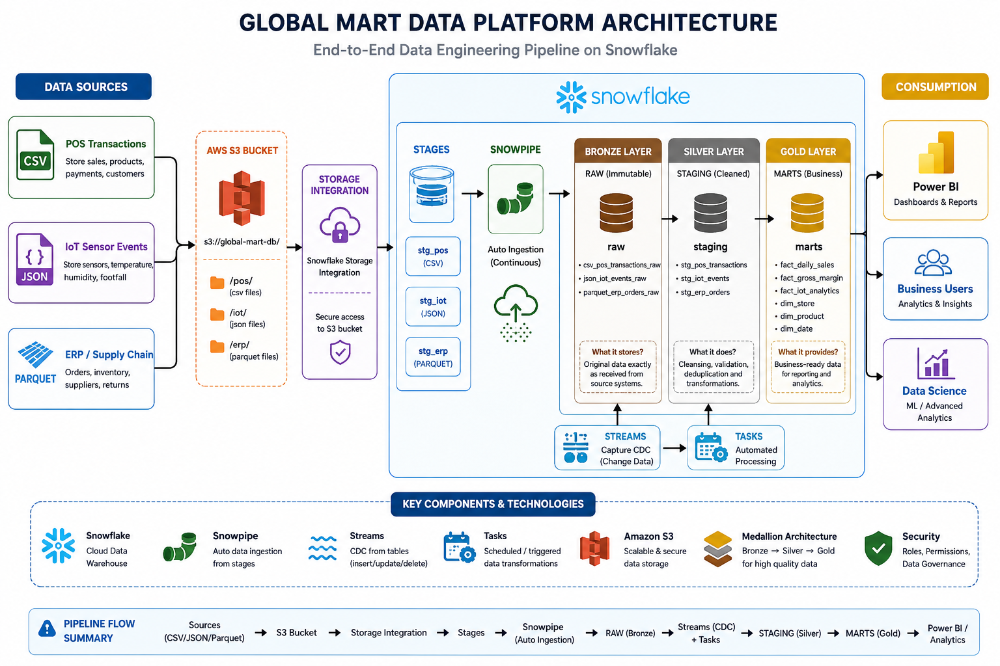

# 🚀 Snowflake Global Mart Data Pipeline

This project builds a production-inspired retail data platform that ingests, transforms, and serves enterprise retail data using Snowflake's Medallion Architecture.
---

## 📖 Project Overview

This project simulates a production-style retail data platform where multiple data sources are ingested into Snowflake for analytics.

The pipeline processes structured and semi-structured data from CSV, JSON, and Parquet files stored in Amazon S3. Using Snowpipe, Streams, and Tasks, the data is automatically loaded, transformed through the Medallion Architecture (Bronze, Silver, and Gold layers), and prepared for business reporting in Power BI.

The objective of this project is to demonstrate modern Data Engineering concepts, including automated ingestion, Change Data Capture (CDC), scheduled transformations, and scalable cloud data warehousing.

---
# 🏗️ Architecture

The following architecture illustrates the complete end-to-end data flow from data ingestion to business reporting.

---

# 🛠️ Technology Stack

| Category | Technologies |
|-----------|--------------|
| Cloud | AWS S3 |
| Data Warehouse | Snowflake |
| Language | SQL |
| Data Ingestion | Snowpipe |
| CDC | Streams |
| Automation | Tasks |
| Data Architecture | Medallion Architecture |
| Analytics | Power BI |

# 📊 Data Sources

This project ingests data from multiple enterprise systems to simulate a real-world retail environment.

| Data Source | File Format | Description |
|-------------|-------------|-------------|
| POS Transactions | CSV | Retail sales, customers, products, and payments |
| IoT Sensor Events | JSON | Store temperature, humidity, footfall, and sensor events |
| ERP / Supply Chain | Parquet | Orders, inventory, suppliers, warehouses, and returns |
